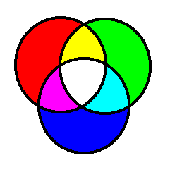

## About colour composites

Multispectral imagery, such as Sentinel-2, consists of several bands of data. As seen during in previous chapter, these bands can be displayed individually as a grey scale image (black = low reflectance, white = high reflectance), but they can also be displayed as a combination of three bands: a **colour composite** (NL: kleurcomposiet).  

When creating a colour composite: the three primary colours are used: red, green and blue. When they are combined in various proportions, different colours are produced per pixel. When 3 spectral bands (both visible as non-visible bands) are assigned to a primary colour, a colour composite is formed.

{: align=center }  
*By combining different proportions of the three primary colours Red, Green and Blue, various colours are created*

## Two "famous" colour composites

### True Colour Composite
The most straightforward colour composite is the **true colour composite** (also **natural colour composite**), where the three visual primary colour bands of a multispectral image are assigned to their corresponding colour. 

For Sentinel 2, this composite is created as: Red: B4, Green: B3, Blue: B2.

     
  <em> Sentinel-2 Normal Composite of Ghent. </em>

 

### False Colour Composite

Beside the 'normal' colour composites, any band of a multispectral satellite image can be  assigned to the primary colour bands in a composite. In all those other cases, the colour of a target object on the image, will have a different colour compared to it's actual colour.

The most famous of these is the **False Colour Composite**, where the NIR-band is assigned to the red colour, the red band to the green colour and the green band to the blue colour. It is very suitable to detect vegetation, since vegetation has a high reflectance in the NIR band.  

Clear water will appear dark-bluish, while turbid water (with a lot of sediments) will be cyan. Bare soils, roads and buildings may appear in various shades of blue, yellow or grey, depending on their composition.

For Sentinel 2, this composite is created as: Red: B8, Green: B4, Blue: B3.

     
  <em> Sentinel-2 False Colour Composite of Ghent. </em>

 

## Opening a RGB image in SNAP

Let's create our own image composites in SNAP! This is actually very easy to do. Just right-click on the image folder and click on 'Open RGB Image window':

    

 

A window will appear with some possible S2 band combinations, but you can also create your own.

    

 

Some typical S2 band combinations have their own name, such as (Red, Green, Blue):

 - Natural Colour: **4 3 2** *  
 - False colour Infrared: **8 4 3** *  
 - False colour Urban: **12 11 4**  
 - Agriculture: **11 8 2**  
 - Atmospheric penetration: **12 11 8a** *  
 - Healthy vegetation: **8 11 2**  
 - Land/Water: **8 11 4**  
 - Natural Colours with Atmospheric Removal: **12 8 3 ** 
 - Shortwave Infrared: **12 8 4**  
 - Vegetation Analysis: **11 8 4**  

!!! question " "
    With the current Sentinel-2 Level 1C-product open, only the band combinations with a * can now be displayed. Why is that? 

!!! note "Excercise: open band composites"
    - Open the image as a natural colour composite  
    - Open the image as a false colour infrared composite  
    - Tile the images evenly and explore the difference in colour (for example in the areas with green vegetation).